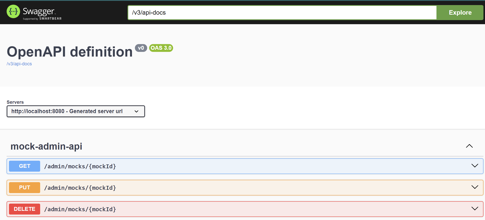

# Getting Started

### Documentación
Esta aplicación tiene como finalidad simular los servicios que se registren como mock.

### Guía de uso

#### Compilar código fuente
```bash
mvn clean verify
```

#### Desplazarse a la ruta del jar
```bash
cd jmock-server-app/target
```

#### Ejecutar la aplicación
```bash
java -jar jmock-server-app-0.0.1-SNAPSHOT.jar
```
Una vez iniciada la aplicación podemos acceder a la página del swagger de la aplicación en la ruta 
http://localhost:8080/swagger-ui.html



#### Registro de un mock
En este registraremos un servicio que consulta un libro con `id: 10`. Su respuesta será el JSON 
definido, el `Header: traceId`, estado HTTP 200 y con un tiempo de  `delay: 2000` (el tiempo está expresado en milisegundos)
```bash
curl -X 'POST' \
  'http://localhost:8080/admin/mocks' \
  -H 'accept: application/json' \
  -H 'Content-Type: application/json' \
  -d '{
  "name": "Servicio de prueba",
  "path": "/books/10",
  "method": "GET",
  "response": {
    "body": {
		"type": "JSON",
		"value": "{\"name\":\"Clean Code\",\"author\":\"Pepe\",\"id\":10}"
	},
    "headers": [
      {
        "name": "traceId",
        "value": "1231231231244554657"
      }
    ],
    "httpStatus": 200,
    "delay": 2000
  }
}'
```
Luego de registrar invocar al servicio "mockeado" a través de la operación `/jmock-server/`
```bash
curl --location 'http://localhost:8080/jmock-server/books/10'
```
También es posible utilizar expresiones regulares en el path. Por ejemplo para que el id de búsqueda no sea fija, 
si no sólo valide que esa un número.
```bash
curl -X 'POST' \
  'http://localhost:8080/admin/mocks' \
  -H 'accept: application/json' \
  -H 'Content-Type: application/json' \
  -d '{
  "name": "Servicio de prueba de clientes",
  "path": "/customers/([0-9]+)",
  "method": "GET",
  "response": {
	"body": {
		"type": "JSON",
		"value": "{\"name\":\"Pepe\",\"id\":10}"
	},
    "httpStatus": 200
  }
}'
```
Al invocar invocar el servicio de las siguientes maneras, la aplicación debería ser capaz de responder correctamente.
```bash
curl --location 'http://localhost:8080/jmock-server/customers/10123123123'
curl --location 'http://localhost:8080/jmock-server/customers/1'
curl --location 'http://localhost:8080/jmock-server/customers/26'
```

### Observaciones
La aplicación aún se encuentra en desarrollo y los mocks registrados de momento se están almacenando en memoria, posteriormente
se tiene planeado almacenarlos de forma física en una Base de Datos.